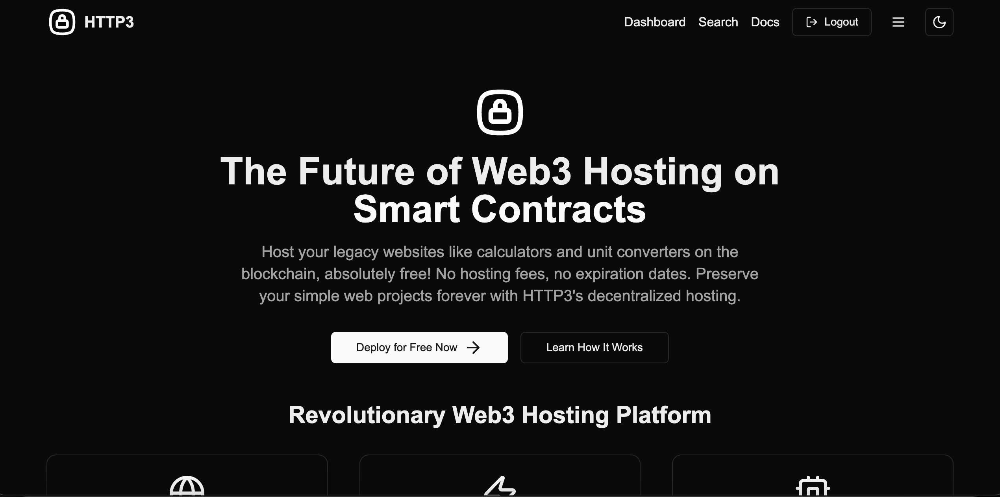
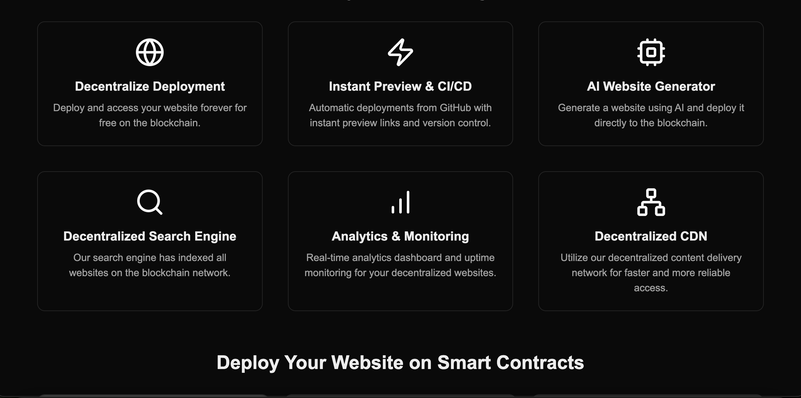
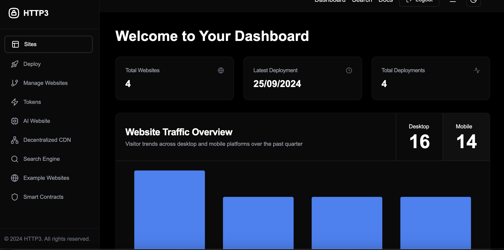
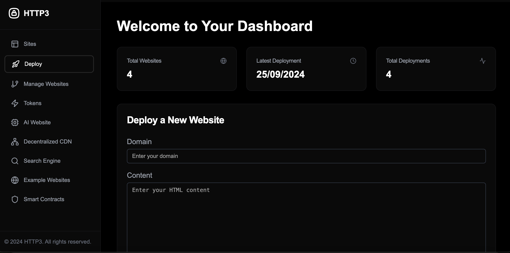
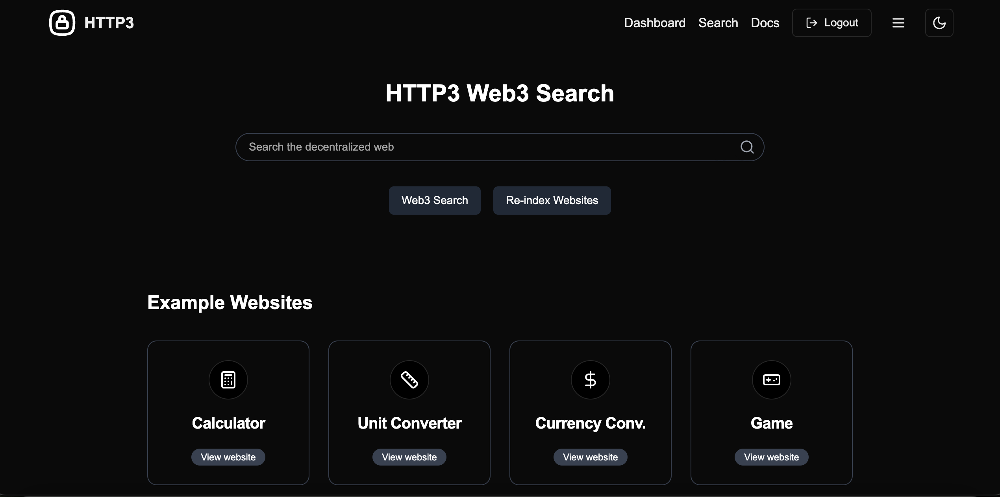

<div align="center">

  
  <h1>HTTP3 - Decentralized Web Hosting Platform</h1>
  
  <p>
    A revolutionary platform for hosting websites on the blockchain, ensuring permanent and censorship-resistant web presence.
  </p>

<h4>
    <a href="https://htt3.netlify.app/dashboard">View Demo</a>
  <span> · </span>
    <a href="https://github.com/yourusername/http3">Documentation</a>
  <span> · </span>
    <a href="https://github.com/yourusername/http3/issues/">Report Bug</a>
  <span> · </span>
    <a href="https://github.com/yourusername/http3/issues/">Request Feature</a>
  </h4>
</div>

<br />

# Table of Contents

- [About the Project](#star2-about-the-project)
  - [Screenshots](#camera-screenshots)
  - [Tech Stack](#space_invader-tech-stack)
  - [Features](#dart-features)
  - [Color Reference](#art-color-reference)
  - [Environment Variables](#key-environment-variables)
- [Getting Started](#toolbox-getting-started)
  - [Prerequisites](#bangbang-prerequisites)
  - [Installation](#gear-installation)
  - [Running Tests](#test_tube-running-tests)
  - [Run Locally](#running-run-locally)
  - [Deployment](#triangular_flag_on_post-deployment)
- [Usage](#eyes-usage)
- [Roadmap](#compass-roadmap)
- [Contributing](#wave-contributing)
  - [Code of Conduct](#scroll-code-of-conduct)
- [FAQ](#grey_question-faq)
- [License](#warning-license)
- [Contact](#handshake-contact)
- [Acknowledgements](#gem-acknowledgements)

## About the Project

HTTP3 is a revolutionary decentralized web hosting platform that leverages blockchain technology to provide permanent, censorship-resistant website hosting. It combines the power of IPFS (InterPlanetary File System) with smart contracts to create a robust, decentralized infrastructure for the web.

### Screenshots

<div align="center"> 
  
    
     
      
       
</div>

### Tech Stack

<details>
  <summary>Client</summary>
  <ul>
    <li><a href="https://www.typescriptlang.org/">TypeScript</a></li>
    <li><a href="https://nextjs.org/">Next.js</a></li>
    <li><a href="https://reactjs.org/">React.js</a></li>
    <li><a href="https://tailwindcss.com/">TailwindCSS</a></li>
  </ul>
</details>

<details>
  <summary>Server</summary>
  <ul>
    <li><a href="https://www.typescriptlang.org/">TypeScript</a></li>
    <li><a href="https://nextjs.org/">Next.js API Routes</a></li>
    <li><a href="https://www.prisma.io/">Prisma</a></li>
  </ul>
</details>

<details>
<summary>Database</summary>
  <ul>
    <li><a href="https://www.postgresql.org/">PostgreSQL</a></li>
  </ul>
</details>

<details>
<summary>DevOps</summary>
  <ul>
    <li><a href="https://www.docker.com/">Docker</a></li>
  </ul>
</details>

### Features

- Decentralized Deployment: Host websites on the blockchain, ensuring permanent availability.
- Instant Preview & CI/CD: Automatic deployments from GitHub with instant preview links.
- Decentralized Search Engine: Index and search all websites hosted on the platform.
- Analytics & Monitoring: Real-time analytics dashboard and uptime monitoring for your decentralized websites.
- Decentralized CDN: Utilize our decentralized content delivery network for faster and more reliable access.
- Smart Contract Integration: Deploy and interact with smart contracts directly from the platform.
- Token Economy: Earn and stake tokens for hosting and maintaining the network.

### Environment Variables

To run this project, you will need to add the following environment variables to your .env file

`DATABASE_URL`

`PRIVATE_KEY`

`GEMINI_API_KEY`

## Getting Started

### Prerequisites

This project uses npm as package manager

```bash
 npm install --global npm
```

### Installation

Install HTTP3 with npm

```bash
  npm install http3
  cd http3
```

### Running Tests

To run tests, run the following command

```bash
  npm run test
```

### Run Locally

Clone the project

```bash
  git clone https://github.com/yourusername/http3.git
```

Go to the project directory

```bash
  cd http3
```

Install dependencies

```bash
  npm install
```

Start the server

```bash
  npm run dev
```

### Deployment

To deploy this project run

```bash
  npm run build
  npm run start
```

## Usage

1. Connect your Web3 wallet to the platform.
2. Navigate to the Dashboard to deploy a new website or manage existing ones.
3. Use the AI Website Generator to create a website quickly.
4. Deploy your website to the decentralized network.
5. Monitor your website's performance and analytics.
6. Participate in the token economy by staking and earning rewards.

Here's a basic example of deploying a website:

```javascript
import { createWebpage } from "@/utils/db/actions";

async function deployWebsite(userId, domain, content) {
  try {
    const { webpage, txHash, cid, deploymentUrl } = await createWebpage(
      userId,
      domain,
      content
    );
    console.log(`Website deployed successfully. URL: ${deploymentUrl}`);
  } catch (error) {
    console.error("Deployment failed:", error);
  }
}
```

## Roadmap

- [x] Implement basic website deployment
- [x] Integrate with IPFS
- [x] Develop smart contract for storing website metadata
- [ ] Implement token economy
- [ ] Enhance analytics and monitoring features

Contributions are always welcome!

See `contributing.md` for ways to get started.

### Code of Conduct

Please read the [Code of Conduct](https://github.com/yourusername/http3/blob/master/CODE_OF_CONDUCT.md)

## FAQ

- How is my website stored on the blockchain?

  - Your website content is stored on IPFS, and the IPFS hash (CID) is stored on the blockchain along with metadata about your website.

- Can I update my website after deployment?
  - Yes, you can update your website content at any time. Each update will create a new IPFS hash, which will be recorded on the blockchain.

## :warning: License

Distributed under the MIT License. See LICENSE.txt for more information.

## Contact

Project Link: [https://github.com/blocklinklabs/http3](https://github.com/blocklinklabs/http3)

## Acknowledgements

- [IPFS](https://ipfs.io/)
- [Ethereum](https://ethereum.org/)
- [Next.js](https://nextjs.org/)
- [Tailwind CSS](https://tailwindcss.com/)
- [Prisma](https://www.prisma.io/)
